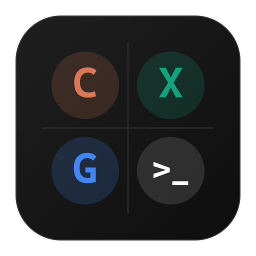
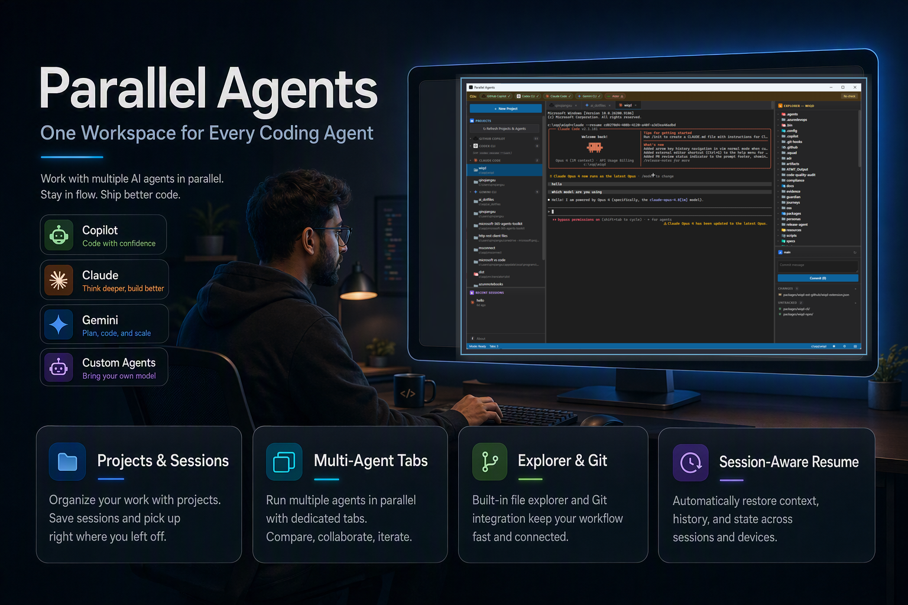
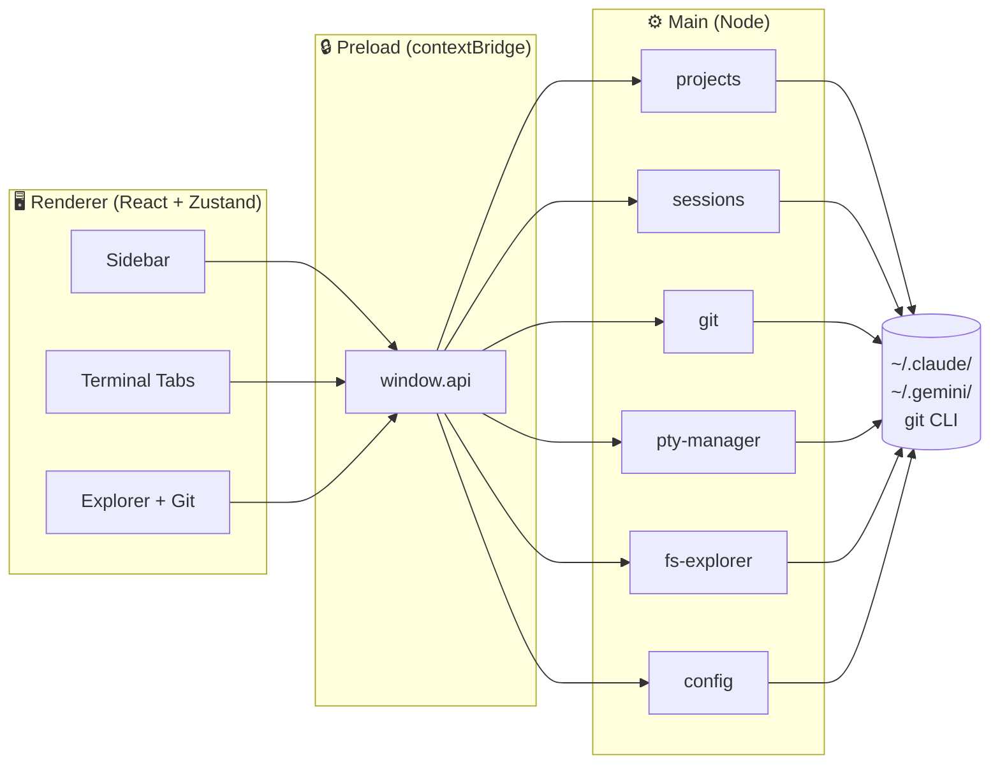

<div align="center">
  

  <h1>Parallel Agents</h1>

  <p>
    <strong>One window. Every AI coding agent. Side by side.</strong>
  </p>

  <p>
    Run <a href="https://www.anthropic.com/claude-code">Claude Code</a>, <a href="https://github.com/openai/codex">Codex</a>, <a href="https://github.com/google-gemini/gemini-cli">Gemini CLI</a> and friends in a single Electron window — with a project switcher, file explorer, and Git panel built in.
  </p>

  <p>
    <a href="https://github.com/jelllove/ParallelAgents/releases"></a>
    <a href="https://github.com/jelllove/ParallelAgents/stargazers"></a>
    <a href="LICENSE"></a>
    
    
    
  </p>

  <p>
    <a href="#-quick-start">Quick Start</a> ·
    <a href="#-features">Features</a> ·
    <a href="#-screenshots">Screenshots</a> ·
    <a href="SPEC.md">Spec</a> ·
    <a href="ARCHITECTURE.md">Architecture</a>
  </p>

  <br />

  <!-- Replace docs/hero.png with your own screenshot or GIF (1600x900 recommended) -->
  
</div>

<br />

## ✨ Why Parallel Agents?

Modern coding agents are **terminal-first** — every CLI insists on owning its own window. If you use more than one, your desktop becomes a forest of look-alike black rectangles. Their session histories scatter across `~/.claude/`, `~/.gemini/`, `~/.codex/`, and nobody remembers which agent you used for which project last time.

**Parallel Agents** collapses all of that into a single, VS Code–style window:

- 📂 **Unified project list** across Claude Code, Codex, Copilot CLI, and Gemini CLI — grouped by agent, sorted by you.
- 🪟 **Tabbed terminals** so you can run Claude on one tab and Codex on the next, on the same repo.
- 📁 **File explorer** with proper file ops (create, rename, cut/copy/paste, trash, reveal in OS, open with default).
- 🌿 **Git panel** in the spirit of VS Code Source Control — stage, unstage, discard, commit, and double-click for a Monaco diff.
- 🧠 **Remembered context** — last-used agent per project, custom project order, window layout, all persisted.
- 🎨 **Swappable layout** — pick any of the 6 left/center/right permutations from the status bar.

> Built for individual developers who juggle multiple AI agents and don't want their workflow held hostage by tab chaos.

<br />

## 🚀 Quick Start

### Option A: Download a pre-built release

1. Grab the latest Windows build from [**Releases**](https://github.com/jelllove/ParallelAgents/releases).
2. Unzip and run **`Parallel Agents.exe`**. That's it — no installer, fully portable.

### Option B: Build from source

```bash
git clone https://github.com/jelllove/ParallelAgents.git
cd ParallelAgents
npm install
npm run dev          # hot-reload dev mode
npm run release      # produces release/latest/Parallel Agents.exe
```

> Requires Node.js 20+ and Windows Build Tools (for `node-pty`). The repo ships `install-vs-buildtools.ps1` if you need them.

<br />

## 🤖 Supported Agents

| Agent | CLI | Status |
|---|---|---|
|  **Copilot CLI** | `gh copilot` | ✅ Sessions auto-detected from `~/.copilot/session-state/` |
|  **Codex** | `codex` | ✅ Sessions auto-detected from `~/.codex/sessions/` |
|  **Claude Code** | `claude` | ✅ Sessions auto-detected from `~/.claude/projects/` |
|  **Gemini CLI** | `gemini` | ✅ Sessions auto-detected from `~/.gemini/tmp/` |
|  Aider | `aider` | 🚧 Launch only (no session scan yet) |

Don't have one installed? Parallel Agents shows a banner at the top with a one-click install hint.

<br />

## 🎯 Features

### Sidebar — Projects & Sessions
- Tree grouped by agent, collapsible per group
- Pin / Hide / **Delete** (triple-confirm: type the project name + check "I understand")
- **Drag & drop** to reorder projects within the same agent group
- **Refresh Projects & Agents** button + automatic background refresh every 60 seconds
- Click project behavior: one session auto-resumes, multiple sessions trigger a visual cue in **Recent Sessions** so you can choose explicitly
- Per-session × button with the same confirm flow

### Terminal Tabs
- Independent PTY per tab via `node-pty`
- Same project can be opened with multiple agents simultaneously
- "Last used agent" remembered per project so re-opening is one click
- `PATH` augmented at spawn time so globally-installed CLIs are always found

### Explorer
- Right-click menu: New File / New Folder / Rename / Cut / Copy / Paste / Open / Reveal / **Delete to Recycle Bin**
- Double-click any file or folder to open with the **Windows default program**
- Keyboard shortcuts: `Ctrl+C` / `Ctrl+X` / `Ctrl+V` / `F2` / `Delete`

### Git Panel
- Branch, ahead/behind, staged / unstaged / untracked groups
- Stage / unstage / discard per file or whole group; commit message + Commit button
- Double-click a changed file → full-screen **Monaco Diff Editor**
- Auto-refreshes on disk changes via `fs.watch` on `.git/index` + 5s polling fallback

### Layout
- Click `⊞` in the status bar to switch the 3-column order — 6 permutations
- Each column keeps **its own current size proportion** when moved
- Order + sizes are persisted to `~/.claude/parallel-agents.json` and restored on next launch

<br />

## 📸 Screenshots

> _Drop your screenshots into `docs/` to populate this section._

<table>
  <tr>
    <td align="center">
      <br />
      <sub><b>Main window</b> — Sidebar · Terminal · Explorer + Git</sub>
    </td>
    <td align="center">
      <br />
      <sub><b>Diff window</b> — double-click any changed file</sub>
    </td>
  </tr>
  <tr>
    <td align="center">
      <br />
      <sub><b>Layout picker</b> — 6 permutations, sizes follow each pane</sub>
    </td>
    <td align="center">
      <br />
      <sub><b>Explorer</b> — full file ops with right-click menu</sub>
    </td>
  </tr>
</table>

<br />

## 🏗 Architecture (TL;DR)



See [**ARCHITECTURE.md**](ARCHITECTURE.md) for the full diagram, IPC channel table, and critical flows.

<br />

## ⚙️ Persistence

All user state lives in a single file: `~/.claude/parallel-agents.json`

```jsonc
{
  "pinned": ["claude:C--user-myrepo"],
  "hidden": [],
  "lastAgentByProject": { "claude:C--user-myrepo": "claude" },
  "projectOrder": { "claude": ["..."], "gemini": [] },
  "layout": {
    "order": ["sidebar", "middle", "right"],
    "sizes": [20, 58, 22]
  }
}
```

Delete it at any time to reset to factory defaults — no data loss, just a fresh layout.

<br />

## 🛣 Roadmap

- [ ] macOS / Linux builds
- [ ] Cross-session full-text search
- [ ] Light theme
- [ ] First-run wizard to install missing CLIs
- [ ] Agent extension API (add your own CLI in 30 lines)
- [ ] Per-tab terminal split

Have an idea? [Open an issue](https://github.com/jelllove/ParallelAgents/issues/new) — feature requests welcome.

<br />

## 🛠 Tech Stack

| Layer | Choice | Why |
|---|---|---|
| Shell | [Electron 32](https://www.electronjs.org/) | Native PTY + filesystem + system menus |
| Bundler | [electron-vite](https://electron-vite.org/) | Fast HMR for main/preload/renderer |
| UI | [React 18](https://react.dev/) + [TypeScript](https://www.typescriptlang.org/) | |
| State | [Zustand](https://zustand-demo.pmnd.rs/) | Single-store simplicity, no boilerplate |
| Terminal | [xterm.js](https://xtermjs.org/) + [node-pty](https://github.com/microsoft/node-pty) | Real PTY semantics, not a fake shell |
| Layout | [react-resizable-panels](https://github.com/bvaughn/react-resizable-panels) | Drag-to-resize columns |
| Diff | [Monaco Editor](https://github.com/microsoft/monaco-editor) | The same diff UI as VS Code |
| Packaging | [electron-builder](https://www.electron.build/) | `--dir` output → portable folder |

<br />

## 🤝 Contributing

PRs welcome! For anything non-trivial, please open an issue first to discuss the change.

```bash
npm install
npm run dev
# Open a PR against main
```

A few house rules:

- Keep dependencies lean — every new dep should pull its weight.
- IPC channels are the API surface; adding one means adding a type in `src/shared/types.ts` and wiring all three layers (main / preload / renderer).
- For UI changes, please attach a before/after screenshot in the PR description.

<br />

## 📄 License

[MIT](LICENSE) © [jelllove](https://github.com/jelllove)

<br />

## 🙏 Acknowledgements

- The Claude Code, Codex, and Gemini CLI teams for shipping the agents this project orbits around.
- [VS Code](https://github.com/microsoft/vscode) — the layout that everyone (including this app) borrows from.
- [Warp](https://warp.dev/) and [Tabby](https://github.com/Eugeny/tabby) for showing that terminals can be beautiful.

<br />

<div align="center">
  <sub>If Parallel Agents saves you a window or two, please consider ⭐ starring the repo — it really helps.</sub>
</div>
