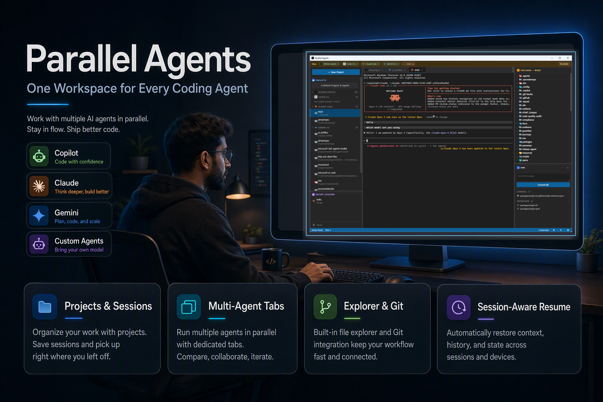
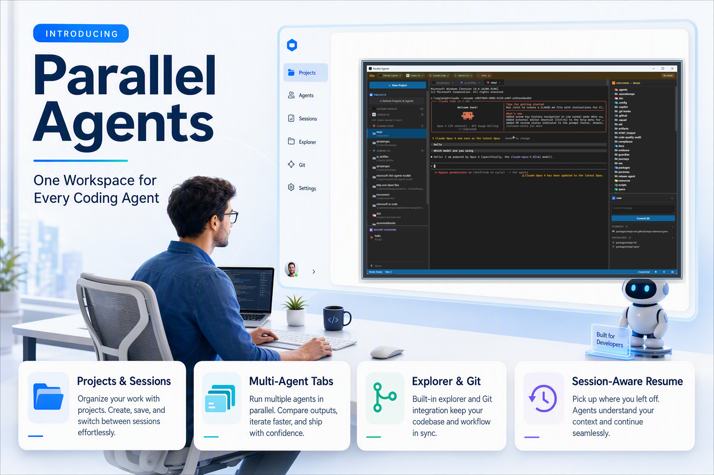

<div align="center">
  
  <h1>Parallel Agents</h1>
  <p><strong>CLI coding agents in one desktop window.</strong></p>
  <p>
    <a href="https://github.com/jelllove/Parallel-Agents/releases"></a>
    <a href="LICENSE"></a>
    
    
  </p>
</div>

Parallel Agents hosts locally installed coding CLIs in real terminals, with a project/session
sidebar, file explorer, and Git panel. It does not replace the agents or supply an AI service.
Launching an agent uses that CLI's own installation, authentication, and permissions.

[Quick start](#quick-start) · [Supported agents](#supported-agents) ·
[Architecture](ARCHITECTURE.md) · [Contributing](CONTRIBUTING.md) · [Agent guide](AGENTS.md)

## Features

- **Project and session discovery** for supported Claude Code, Codex, Copilot CLI, and Gemini CLI
  history formats, including Copilot repository/session metadata.
- **Per-session tabs backed by real PTYs**, with agent start/resume commands, remembered agent
  choices, session rename/link flows, and optional attached shell panes.
- **New project workflow** for opening folders directly or creating Git worktrees before launch.
- **Project cleanup** for deleting missing provider histories after review and acknowledgement.
- **File explorer** with create, rename, copy, move, trash, reveal, and default-application actions.
- **Git panel** for status, staging, unstaging, discarding, commits, and read-only Monaco diffs
  using locally bundled editor assets loaded on demand.
- **Configurable layout and typography**, including six column orders, saved pane sizes,
  dark/light themes, and persisted font size, family, and bold settings.
- **Automatic updates** for installed Windows builds, with explicit restart confirmation.
- **Platform lifecycle**: Windows/macOS close hides the window; Linux close quits after session
  confirmation and does not require a tray. F11 toggles fullscreen.

## Quick start

### Use a release

Download the asset for your platform from
[jelllove releases](https://github.com/jelllove/Parallel-Agents/releases) or the
[qinqingxu mirror](https://github.com/qinqingxu/Parallel-Agents/releases).
The same release source and packages are published to both repositories.
Windows users should run the NSIS installer. For an older portable archive, extract the whole
directory before running `Parallel Agents.exe`. Available artifacts depend on the release.
Versions before 0.1.10 do not include automatic updates, so install an updater-enabled build
manually once before relying on in-app checks.

### macOS and Linux targets

Starting with v0.1.16, the release build targets the following platforms. Each release must pass
native and packaged-app smoke checks on its target host before its packages are published.
macOS/Linux are initial desktop ports, not a claim of compatibility with every system.

| Platform | Architecture          | Distribution                                        |
| -------- | --------------------- | --------------------------------------------------- |
| Windows  | x64                   | `Parallel-Agents-Setup-<version>.exe`               |
| macOS    | Apple Silicon / arm64 | `Parallel-Agents-<version>-mac-arm64.dmg` or `.zip` |
| Linux    | x64, glibc desktop    | AppImage, DEB, and RPM (filenames below)            |

On macOS, open the downloaded DMG and drag the application to
Applications, or extract the ZIP. Initial Mac builds are ad-hoc signed, **not Developer ID signed
or notarized**, and use no hardened-runtime release profile. Gatekeeper may block downloaded
builds; use Apple's per-application approval only for a build you trust, not a global security
bypass. Intel Mac builds are outside this initial target.

Linux packages target x64 glibc desktops with X11 or XWayland:

- **Debian/Ubuntu:** `Parallel-Agents-<version>-linux-amd64.deb`; install the local file with
  `apt install` so dependencies are resolved.
- **Fedora/RHEL-style packaging:** `Parallel-Agents-<version>-linux-x86_64.rpm`; install the
  local file with `dnf install`. RPM generation does not establish compatibility with every
  Fedora/RHEL release; verify its dependencies and native behavior on the intended distribution.
- **Portable:** `Parallel-Agents-<version>-linux-x86_64.AppImage`; mark it executable and run it.

RPM is an addition for the next release; the already-published v0.1.16 contains DEB and AppImage,
not RPM. Use the asset list of the release you download as the authority.
AppImage may require FUSE; distribution packages are preferable on systems that restrict
unprivileged user namespaces.
Do not run the app as root or pass `--no-sandbox` to work around a launch failure.
Linux ARM and musl-based distributions are outside this initial target.

Mac/Linux updates are manual; Windows automatic updates remain unchanged. Git and the desired
agent CLIs must be installed separately. Desktop startup loads PATH from your login shell with
a five-second timeout; failures warn and retain inherited PATH. Terminal clipboard shortcuts are
Command+C/V on macOS and Ctrl+Shift+C/V on Linux, preserving Ctrl+C for interruption.

Build and verify **on the target operating system**, then package without publishing:

```sh
npm ci
npm run validate
npm run dist
```

On Linux, `dist` builds AppImage, DEB, and RPM together. RPM packaging additionally needs
`rpmbuild` (the `rpm` package on Debian/Ubuntu, `rpm-build` on Fedora) and `xz` on PATH.
These are packaging prerequisites, not requirements for ordinary checks or application startup.

`dist` includes native and packaged-app smoke checks. This does not certify DMG/AppImage/DEB/RPM
installation, signing, or every desktop environment; review the
[native smoke procedure](CONTRIBUTING.md#windows-native-smoke-test) and perform installation checks.

Release packages include `SHA256SUMS` for download verification. The
[release workflow](.github/workflows/release.yml) runs locked installation, repository checks,
the dependency audit, and `npm run dist` on Windows x64, Apple Silicon macOS, and Linux x64.
It preserves native/packaged smoke evidence and fails if required distribution files are missing.
The Linux release runner installs RPM build tools and retains all three formats. The release
asset checker requires nonempty DEB and RPM files and records their SHA-256 hashes, so a build
with only one of these installer formats cannot be reported as release-ready.
Publication is a separate explicit operation after all three builds succeed. The workflow itself
does not create or replace a GitHub release; local `npm run release` also does not publish.

### Develop from source

Use **Windows x64**, **macOS arm64**, or **Linux x64**, with **Node.js 24**, **npm 11**, and **Git on PATH**.
[.node-version](.node-version) pins **24.17.0** for reproducible setup; the compatible engine ranges
in [package.json](package.json) are Node `^24.17.0` and npm `>=11 <12`.
The desktop runtime is **Electron 43** (`^43.6.0`), separate from the Node installation used for
development tooling.

From PowerShell:

```powershell
git clone https://github.com/jelllove/Parallel-Agents.git
Set-Location .\Parallel-Agents
npm ci
npm run dev
```

On macOS/Linux, the same npm commands run in a terminal; use `cd Parallel-Agents` after cloning.

Dependency installation may download Electron and native packages. Standard Windows x64 installation
and packaging use the official N-API prebuilds shipped with `node-pty` 1.2.0-beta.13, including
`win32-x64`; a local C++ compiler is not required for this path. Windows Build Tools and matching
Spectre libraries are only prerequisites for an explicit `npm run rebuild` or other source build.
See [native-terminal troubleshooting](CONTRIBUTING.md#native-terminal-troubleshooting); do not
modify system tools or disable Spectre mitigations to make ordinary packaging succeed.

The running app reads your local provider history and settings. Use disposable projects and an
isolated test profile for destructive/manual testing, not your real session history.

For repeatable onboarding, `npm run doctor` reports prerequisites and `npm run setup` performs
the explicit locked installation/check sequence. A native PowerShell entry point, versioned VS Code
tasks, and an optional non-GUI container are described in the
[development environment guide](docs/development-environment.md). None installs hooks or global tools.

### Local validation

```powershell
npm run check
npm run build
```

`check` runs lint, formatting verification, TypeScript checking, local tests, the documentation
contract check, and the agent instruction corpus check. `build` type-checks and produces the Electron bundles in `out`.
`npm run validate` combines both. These checks do not require AI provider credentials or make live
agent requests; passing them does not prove native terminal behavior or provider compatibility.
Optional `npm run test:coverage` adds Node's built-in coverage reporting for modules loaded by the
tests, not whole-repository or native-runtime coverage.
The complete command reference and targeted test workflow are in [CONTRIBUTING.md](CONTRIBUTING.md#local-commands).

`npm run test:ci` adds JUnit/LCOV artifacts, and `npm run test:e2e` is the conventional alias for
the native smoke for the current desktop target. Optional hook setup starts as a preview and requires explicit
opt-in; security and agent-environment workflows remain separate from application behavior.
See the [engineering automation guide](docs/automation.md) for receipts, prerequisites, and
the distinction between configured workflows and actual hosted enforcement.

For native integration checks, run `npm run test:smoke` **after `npm run build`** on the target host.
It launches real Electron and a native command-shell PTY with generated disposable data and inert
AI-provider CLI shims, not real agent CLIs or provider accounts. The fixture selects its generated
Claude project in the UI and opens a diff with HTTP(S) blocked in the test window's Electron session,
asserting that both revisions render offline. It is separate from both `check` and `validate`.
See the [native smoke procedure](CONTRIBUTING.md#windows-native-smoke-test) for prerequisites,
scope, and the generated `reports\smoke.json` and `reports\smoke.png` artifacts.

## Supported agents

| Agent              | Executable | History discovered by this app                                                     |
| ------------------ | ---------- | ---------------------------------------------------------------------------------- |
| GitHub Copilot CLI | `copilot`  | `$HOME\.copilot\session-state\<session>\events.jsonl`                              |
| Claude Code        | `claude`   | `$HOME\.claude\projects\<project>\*.jsonl`                                         |
| Gemini CLI         | `gemini`   | `$HOME\.gemini\tmp\<project>\chats\*.jsonl`, with `.project_root` project metadata |
| Codex CLI          | `codex`    | `$HOME\.codex\sessions\**\*.jsonl` plus `session_index.jsonl` titles               |
| Aider              | `aider`    | No automatic history scan; launch/restore command support                          |

The Copilot executable is standalone **`copilot`**, not a GitHub CLI subcommand.
[Provider definitions](src/main/agent-providers.ts) describe binary detection and installation links;
[shared command builders](src/shared/agent-commands.ts) define launch/resume syntax.
The missing-CLI banner opens installation guidance rather than installing tools for you.
Provider log formats may change; detection is limited to the formats the current readers support.

## Architecture

| Boundary                                | Responsibility                                                                           |
| --------------------------------------- | ---------------------------------------------------------------------------------------- |
| [Main](src/main/index.ts)               | Electron lifecycle, IPC handlers, provider history, filesystem, Git, configuration, PTYs |
| [Preload](src/preload/index.ts)         | Typed `window.api` bridge from renderer to main                                          |
| [Renderer](src/renderer/App.tsx)        | React UI, Zustand application state, xterm terminals, local Monaco editor bundle         |
| [Shared contracts](src/shared/types.ts) | API and data types used across the boundaries                                            |

The current window explicitly enables `sandbox` and `contextIsolation` and disables
`nodeIntegration`. These process boundaries do not replace validation of privileged IPC inputs.
See [ARCHITECTURE.md](ARCHITECTURE.md) for IPC contracts, data flows, and persistence details.
The [runtime and build toolchain](ARCHITECTURE.md#runtime-and-build-toolchain) records the confirmed
baseline; the manifest and lockfile remain authoritative for dependency ranges and resolved versions.
The [offline diff loader](ARCHITECTURE.md#offline-diff-loading) lazy-loads local Monaco and worker
assets instead of fetching the editor from a CDN. This concerns the diff viewer, not the network
requirements of whichever external coding agent you choose to run.

## User data and destructive actions

App settings live at `$HOME\.claude\parallel-agents.json`. They include pinned/hidden projects,
remembered agents, project order, main-pane layout, theme, and terminal/tab preferences.
The Explorer/Git vertical splitter also uses Chromium local storage. Agent histories and files in
your selected projects are separate data, not contents of the settings file.

- **Hide** changes a visibility preference.
- **Delete project/session** can permanently remove provider history. This is not the Explorer's
  recycle-bin action.
- **Explorer trash**, file moves, and **Git discard/commit** operate on real selected project files.

Do not delete settings or provider directories as a routine troubleshooting step. Quit the app and
back up the relevant data before intentional recovery or migration work. Invalid existing settings
are reported rather than silently replaced; there is no automatic recovery promise.

## Demo artwork

These checked-in hackathon illustrations are historical presentation assets, **not screenshots
verifying the current build**.

| Dark presentation                                                                      | Light presentation                                                                       |
| -------------------------------------------------------------------------------------- | ---------------------------------------------------------------------------------------- |
|  |  |

## Packaging

Packaging is optional for normal development. `npm run pack` requests a local unpacked build and
`npm run dist` requests configured distribution artifacts. Both run **build → native smoke →
electron-builder with `--publish never` → `test:packaged`**. `build.npmRebuild: false` retains the
upstream N-API prebuilds instead of recompiling them unnecessarily; native smoke gates remain required.
`test:packaged` repeats the same native/offline UI checks against the real `app.asar` bundle with a
fresh isolated home, producing `reports\packaged-smoke.json` and `reports\packaged-smoke.png`.
Script wiring is not evidence of a successful run or installer verification.

`npm run release` is local packaging and promotion, **not network publishing**. It additionally
replaces the existing `release\latest` directory via
[the promotion script](scripts/promote-latest.cjs). Only run it when you intend to replace those
local artifacts. `pack` and `dist` explicitly retain `--publish never`; packaging may still need
dependency/tool downloads even though publishing is disabled.

## Contributing and project intent

Read [CONTRIBUTING.md](CONTRIBUTING.md) for setup, local checks, and the bounded documentation checker.
[AGENTS.md](AGENTS.md) is the shared guide for coding agents. Changes should preserve existing user
data and unrelated working-tree edits.

The [CI definitions](.github/workflows/ci.yml) configure Windows and Linux validation jobs.
Linux covers non-GUI checks/builds, not a supported desktop runtime. Workflow and CODEOWNERS files
are not evidence that CI ran or that required reviews/checks are enforced; those settings remain
an owner action after publishing. See [CI boundaries](CONTRIBUTING.md#ci-definitions-and-owner-settings).

[SPEC.md](SPEC.md) records product intent, including historical descriptions; use current source
and [ARCHITECTURE.md](ARCHITECTURE.md) for implemented behavior.
Discuss larger changes in [issues](https://github.com/jelllove/Parallel-Agents/issues).
For security reports, follow [SECURITY.md](SECURITY.md), not a public issue.
Contributors are expected to follow the [Code of Conduct](CODE_OF_CONDUCT.md).

## License

[MIT](LICENSE) © [jelllove](https://github.com/jelllove).
